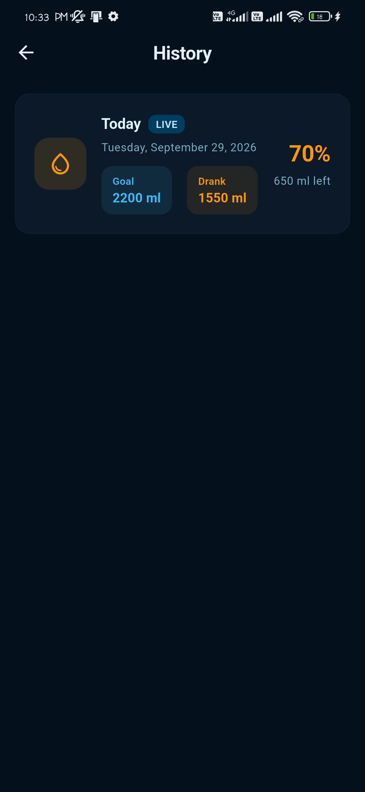
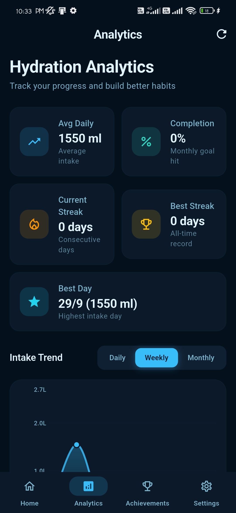
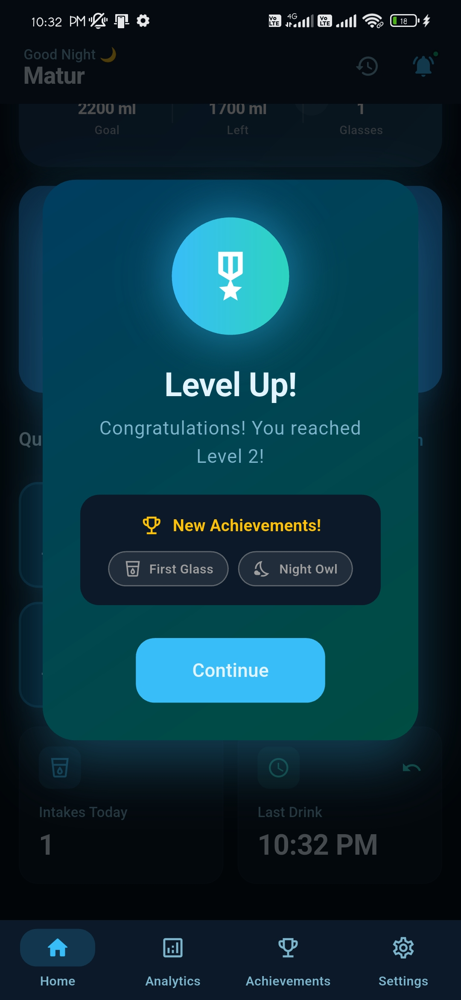
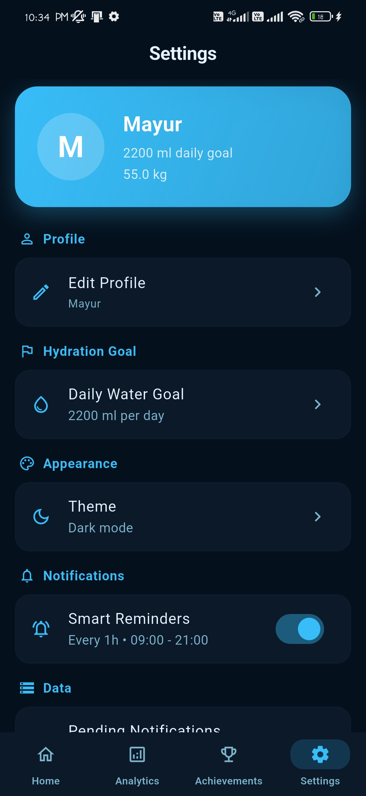

# 💧 Smart Water Reminder

A modern **offline-first Flutter** application that helps users build healthy hydration habits through smart reminders, progress tracking, analytics, and gamification.

Built using **Flutter**, **Provider**, **SQLite**, and **Material 3** with a production-style UI and smooth animations.

---

## ✨ Features

- Smart onboarding with personalized daily water goal
- Weight-based hydration calculation
- Beautiful Material 3 dashboard
- Animated circular water progress
- Quick Add & Custom Water Intake
- SQLite local database
- Provider state management
- Hydration history & timeline
- Analytics dashboard
- Achievement & XP system
- Smart reminder scheduling
- Light & Dark themes
- Offline-first experience
- Smooth animations & premium UI

---

## 🛠 Tech Stack

| Technology | Usage |
|------------|-------|
| Flutter | Cross-platform Development |
| Dart | Programming Language |
| Provider | State Management |
| SQLite (sqflite) | Local Database |
| SharedPreferences | Local Settings |
| flutter_local_notifications | Local Notifications |
| Material 3 | Modern UI |

---

## 📂 Project Structure

```text
lib/
├── core/
├── data/
├── features/
│   ├── onboarding/
│   ├── home/
│   ├── history/
│   ├── analytics/
│   ├── achievements/
│   ├── reminders/
│   └── settings/
├── providers/
└── main.dart
```

---

## 📸 Screenshots

### Splash Screen


### Home Dashboard


### History



### Analytics



### Achievements



### Reminder Setup


### Settings



---

## 🧠 Smart Reminder Logic

The app creates personalized reminders using:

- Weight-based daily water calculation
- Wake-up & Sleep schedule
- Activity level
- Smart interval distribution
- Adaptive reminders throughout the day

Instead of fixed hourly notifications, reminders are intelligently spaced for a more natural hydration experience.

---

## 🚀 Installation

Clone the repository:

```bash
git clone https://github.com/Mayurs26/Smart-Water-Reminder.git
cd Smart-Water-Reminder
```

Install dependencies:

```bash
flutter pub get
```

Run the app:

```bash
flutter run
```

---

## 📦 Build APK

```bash
flutter build apk --release
```

---

## 🎯 Future Improvements

- Hot weather hydration mode
- Workout hydration mode
- Health app integration
- Home screen widgets
- AI hydration insights

---

## 👨‍💻 Author

**Mayur Sonawane**

- GitHub: https://github.com/Mayurs26

---

## ⭐ Portfolio Highlights

- Production-style Flutter architecture
- Offline-first SQLite implementation
- Provider state management
- Material 3 premium UI
- Smooth animations
- Smart hydration reminder engine
- Interview-ready Flutter project